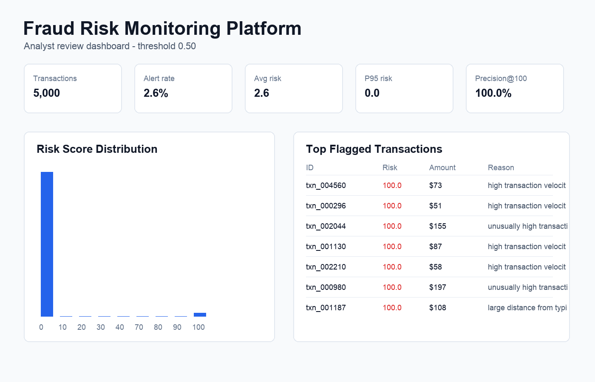

# Fraud Risk Monitoring Platform

An end-to-end fraud detection and analyst review workflow for highly imbalanced transaction data. The project turns a notebook-style credit-card fraud model into a production-minded portfolio project with data ingestion, baseline rules, ML scoring, threshold tuning, explainability, monitoring, and a lightweight dashboard.

## Why This Project Exists

The goal is to show business-focused ML engineering, not just a high offline accuracy score. Fraud teams care about catching risky transactions while managing false-positive review volume, so this repo emphasizes:

- PR-AUC, recall at fixed precision, and precision@top-k
- configurable risk thresholds and expected review volume
- rule-based and ML-based risk signals
- analyst-facing explanations for flagged transactions
- monitoring views for alert volume and score drift

## Project Structure

```text
FraudRiskPlatform/
├── app/                         # Streamlit analyst dashboard
├── data/
│   ├── raw/                     # source CSVs, not committed
│   └── processed/               # generated sample data, not committed
├── docs/                        # architecture and project notes
├── models/                      # trained model artifacts, not committed
├── notebooks/                   # exploration notebooks
├── scripts/                     # CLI workflows
├── src/fraud_risk_platform/     # reusable package code
└── tests/                       # focused unit tests
```

## Quickstart

```bash
python3 -m venv .venv
source .venv/bin/activate
pip install -r requirements.txt

python scripts/generate_sample_data.py
python scripts/train_model.py
python scripts/score_transactions.py
python scripts/benchmark_models.py
python scripts/explain_model.py
python scripts/render_demo_assets.py
streamlit run app/streamlit_app.py
```

The sample-data generator creates synthetic transactions so the repo runs without downloading a private or Kaggle dataset.

## Public Test Dataset

The easiest public dataset to test with this project is Kaggle's [Credit Card Fraud Detection Dataset](https://www.kaggle.com/datasets/miadul/credit-card-fraud-detection-dataset). It already includes transaction-level fraud labels and fields that map cleanly into this repo's feature schema.

After downloading and unzipping the Kaggle CSV into `data/raw/`, run:

```bash
python scripts/prepare_kaggle_dataset.py data/raw/<downloaded-file>.csv
python scripts/train_model.py
python scripts/score_transactions.py
```

The preprocessing script maps public fraud datasets into the expected fields: `amount`, `hour`, `merchant_risk`, `customer_tenure_days`, `transactions_last_24h`, `distance_from_home_km`, `is_foreign`, `is_card_not_present`, and `is_fraud`.

## Sample Results

The current checked workflow uses generated Kaggle-style credit-card transaction data rather than a committed Kaggle CSV. This keeps the repo runnable without requiring a dataset download, while still modeling the same imbalanced fraud-detection problem.

Sample dataset profile:

| Metric | Value |
| --- | ---: |
| Transactions | 5,000 |
| Fraud cases | 134 |
| Fraud rate | 2.68% |

Model results from `python scripts/train_model.py`:

| Metric | Value |
| --- | ---: |
| PR-AUC | 0.9304 |
| ROC-AUC | 0.9977 |
| Recall at 65% precision | 0.9394 |
| Threshold at 65% precision | 0.0064 |

Scoring results from `python scripts/score_transactions.py`:

| Metric | Value |
| --- | ---: |
| Alerted transactions | 131 |
| Alert rate | 2.62% |
| Precision@100 | 1.0000 |

When replacing the generated sample with the actual Kaggle fraud dataset, rerun the training and scoring scripts, then update this section with the new benchmark values.

## Demo Assets



Demo assets for the portfolio site live in `docs/assets/`:

- `dashboard-screenshot.png`
- `fraud-risk-demo.gif`

Regenerate them after scoring new data:

```bash
python scripts/render_demo_assets.py
```

## Core Workflow

1. Generate or ingest transactions.
2. Apply baseline rules to create operational risk flags.
3. Train a calibrated ML model on transaction features.
4. Evaluate with fraud-appropriate metrics.
5. Tune the alert threshold based on precision, recall, and review capacity.
6. Score new transactions and explain why each case was flagged.
7. Monitor score distribution, alert volume, and feature drift.

## Implemented Enhancements

- Model benchmarking: `scripts/benchmark_models.py` compares logistic regression, histogram gradient boosting, and XGBoost when optional dependencies are installed.
- Explainability: `scripts/explain_model.py` produces model-level feature attribution with SHAP when available and permutation importance as a fallback.
- Public dataset ingestion: `scripts/prepare_kaggle_dataset.py` maps a downloaded Kaggle fraud CSV into the platform schema.
- FastAPI scoring: `api/main.py` exposes `/score`, `/score-batch`, and `/health` endpoints.
- Portfolio assets: `scripts/render_demo_assets.py` creates a dashboard screenshot and animated GIF from scored transactions.

Run the API locally:

```bash
uvicorn api.main:app --reload
```

Install optional XGBoost and SHAP support:

```bash
pip install -r requirements-optional.txt
```
